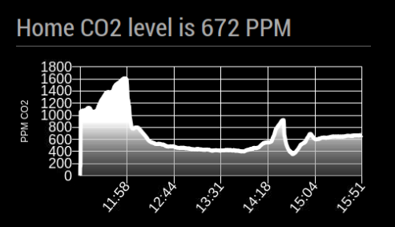
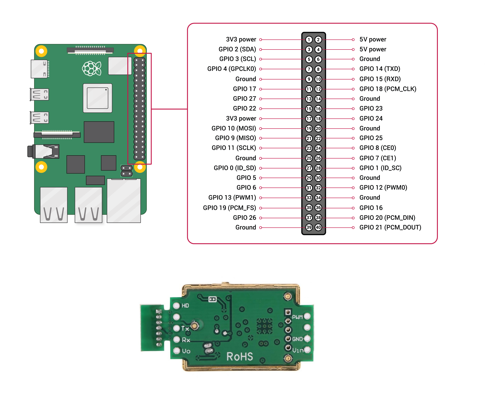

# MMM-MHZ19

  

This is an extension for the [MagicMirror²](https://github.com/MichMich/MagicMirror).

It monitors CO2 level from [MH-Z19 sensor](https://revspace.nl/MHZ19) and draws a chart for a few last hours.

  



  

## Installation

1. Navigate into your MagicMirror's `modules` folder

2. Clone repository `git clone https://github.com/awitwicki/MMM-MHZ19`

3. Go to newly created directory

4. Execute `npm install` to install the node dependencies.
 > If you got error, try to execute `npm install chartjs`
  
5. Connect the MH-Z19 to your Raspberry Pi



| Raspberry pi | MH-Z19 |
|--|--|
|  GPIO 17 | PWM |
|  Ground| GND|
| 5V power | VIN|


  

## Using the module

  

Add it to the modules array in the `config/config.js` file:

  

````javascript
modules: [
	...
	{
		module:  'MMM-MHZ19',
		position:  'top_left',
		config: {
			updateInterval:  100  //seconds
			}
	},
	...
]
````

  

## Configuration options

  

Configurations properties

  | Property| Description |
|--|--|
|  `titleText` | **Type**  `string`, **Default value** `Home weather`|
|  `updateInterval` | **Type**  `int`, **Default value** `100`, **Minimal value** `10`, Wait interval between readings of BME280 sensor values in seconds|


## Developer Notes

For more details about BCM pin numbers check [here](http://www.raspberrypi-spy.co.uk/2012/06/simple-guide-to-the-rpi-gpio-header-and-pins)

  

## Dependencies

-  `python3` (should be installed on Raspberry Pi)

-  `RPi.GPIO` (Python library, should be installed on Raspberry Pi )

  

## Test MH-Z19 module

1. Navigate into your **MagicMirror** folder
2. Run .sh script `./modules/MMM-MHZ19/mh_z19.sh`
(If script doesn't run, add exec parameter to it)
`sudo chmod +x modules/MMM-MHZ19/mh_z19.sh`.
3. Script should print sensor values like this
`566` - that means `CO2 PPM in air`
> Notice that MH-Z19 module can return small values (<400 PPM) continuously in a few seconds after hardware module was started (by connecting power voltage pin).
  

### Thanks

  

[MMM-DHT-Sensor module](https://github.com/bernardpletikosa/MMM-DHT-Sensor)
